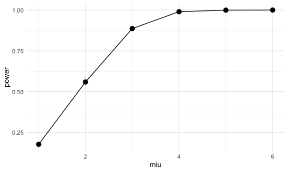
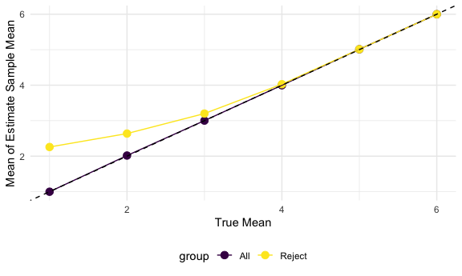
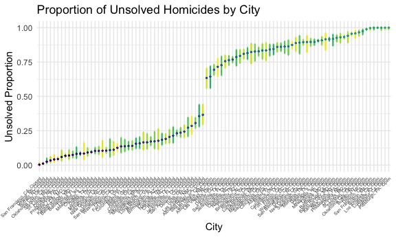

p8105_hw5_lq2250
================
Lanlan_Qing
2025-11-10

## Initial Settings

## Problem 1

1.  **Uniform Distribution Function**

``` r
# Make the function for returning logistic values of P(X>=2)
birth_uniform = function(n) {
  sample = sample(365, n, replace = TRUE) # randomize birthday samples from 365 days
  n_obs_max = max(table(sample)) # find the mode (represents the highest repeated number)
  n_obs_max >= 2 # return TRUE if appear more than twice
}
```

2.  **Make the data frame and plot**

``` r
# Make the data frame of group size 2:50 that iterate 10000 times each
birth_df = replicate(10000, map_lgl(2:50, birth_uniform)) |>
  as.data.frame() |>  # convert matrix to data frame
  mutate(group_size = as.factor(2:50)) |>  # add indicate column for size
  relocate(group_size) |>
  pivot_longer(
    "V1":"V10000",
    names_to = "iteration",
    values_to = "judgement"
  ) |>
  select(-iteration) |>
  group_by(group_size, judgement) |> 
  summarise(n_judge = n()) |> # count #TRUE and #FALSE for each group size
  mutate(prob = as.numeric(n_judge/10000), # transfer #observation to prob
         group_size = fct_inorder(str_c("group size = ", group_size))) # Rename group_size
```

    ## `summarise()` has grouped output by 'group_size'. You can override using the
    ## `.groups` argument.

``` r
# Make a plot showing prob ~ group size
birth_plot = birth_df |>
  plot_ly(x = ~group_size, y= ~prob, color = ~judgement, type = "bar")

print(birth_plot)
```

**Comment** This is a good simulation result. When group size turns to
be small(\<23), it is less likely that there are more than two people
share the same birthday(FALSE more). As group size increasing (\>=23),
the probability of people’s birthday dates tend to be the same becomes
larger(TRUE more). This totally makes sense since there are 365 days.
The possibility of given birth at the same day should increases with
larger group size.

## Problem 2

1.  **Make Normal Function**

``` r
t_test_func = function(miu){
  sample_data = rnorm(30, mean = miu, sd = 5) # Generate samples(n=30) from normal distribution N(0,25)
  test_result = t.test(sample_data, alternative = "two.sided", mu = 0, paired = FALSE, conf.level = 0.95)
  return(test_result)
  # T-test of each group of samples by two.sided test
}
```

2.  **Clean the results and keep necessities**

``` r
# Generate 5000 times for each miu
t_test_results = map_dfr(1:6, function(miu) {  
  map_dfr(1:5000, function(i) {  
    t_test_func(miu) |> broom::tidy()
  }) |> 
  mutate(miu = miu)
}) |>  
  relocate(miu) |> 
  select(miu, estimate, p.value) |>
  mutate(reject_null = p.value < 0.05) |>
  select(-p.value)
```

3.  **Clean data for the first plot (miu ~ power)**

``` r
power_df = t_test_results |>
  group_by(miu) |>
# Calculate effect size by miu group
  summarize(mean = mean(estimate),
            s = sd(estimate),
            effect_size = abs(mean)/s,
            power = mean(reject_null),
            reject_null,
            miu) |>
  ungroup() |>
  select(-reject_null) |>
  distinct()
```

    ## Warning: Returning more (or less) than 1 row per `summarise()` group was deprecated in
    ## dplyr 1.1.0.
    ## ℹ Please use `reframe()` instead.
    ## ℹ When switching from `summarise()` to `reframe()`, remember that `reframe()`
    ##   always returns an ungrouped data frame and adjust accordingly.
    ## Call `lifecycle::last_lifecycle_warnings()` to see where this warning was
    ## generated.

    ## `summarise()` has grouped output by 'miu'. You can override using the `.groups`
    ## argument.

**Make Plot!**

``` r
power_plot <- ggplot(power_df, aes(x = miu, y = power)) +
  geom_point(size = 3) +
  geom_line()

print(power_plot)
```


**Comment**  
The larger the true mean (effect size), the closer the test power is to
1(the easier it is to reject the null hypothesis).

4.  **Clean data for the second plot (miu ~ mean estimate)**

``` r
# Data for all miu_hat
est_df1 = t_test_results |>
  group_by(miu) |>
  summarize(mean = mean(estimate),
            group = "All")

# Data for rejected miu_hat
est_df2 = t_test_results |>
  filter(reject_null == TRUE) |>
  group_by(miu) |>
  summarize(mean = mean(estimate),
            group = "Reject")

# Combine two datasets
mean_est_df = rbind(est_df1, est_df2)
```

**Make Plot**

``` r
mean_est_plot = ggplot(mean_est_df, aes(x = miu, y = mean, color = group)) +
  geom_point(size = 3) +
  geom_line()+
  geom_abline(intercept = 0, slope = 1, linetype = "dashed")+
  labs(
    x = "True Mean",
    y = "Mean of Estimate Sample Mean"
  )

print(mean_est_plot)
```


**Comment** - For all samples, the average estimated mean $\hat{\mu}$ is
approximately equal to the true $\mu$ (almost overlap with the reference
line y=x), which demonstrates the unbiasedness of the sample mean.

- For samples that reject the null hypothesis, $\hat{\mu}$ is also
  approximately equal to the true μ. Because the inference of the t-test
  is “whether there is sufficient evidence to reject H0”, and the
  unbiasedness of the estimator does not rely on the results of the
  hypothesis test. Even if only the samples that reject H0 are
  considered, the average estimate can still accurately reflect the true
  parameters.

## Problem 3

1.  Import and clean the dataset

``` r
homi_df = read_csv("./data/homicide-data.csv",
                   na = c("NA","",".")) |>
  janitor::clean_names() |>
  mutate(city_state = str_c(city, ", ", state)) |> # create city_state variable
  select(-city, -state) |>
  mutate(status = case_when(
    str_detect(disposition, "^Open") ~ "Open",
    str_detect(disposition, "^Closed") ~ "Closed"),
    resolution = str_remove(disposition, status),
    resolution = str_trim(resolution, side = "left"),
    resolution = str_remove(resolution, "^/") 
  ) |> # separate disposition for clearer status
  mutate(resolution = str_replace(resolution, "without", "no"),
         resolution = str_replace(resolution, "No", "no")
  ) |>
  select(uid, city_state, status, resolution, lat, lon, -disposition) # keep necessities
```

    ## Rows: 52179 Columns: 12
    ## ── Column specification ────────────────────────────────────────────────────────
    ## Delimiter: ","
    ## chr (9): uid, victim_last, victim_first, victim_race, victim_age, victim_sex...
    ## dbl (3): reported_date, lat, lon
    ## 
    ## ℹ Use `spec()` to retrieve the full column specification for this data.
    ## ℹ Specify the column types or set `show_col_types = FALSE` to quiet this message.

2.  Summarize proportion of homicides by city_state

``` r
md_prop_table = homi_df |>
  filter(str_detect(city_state, "MD")) |>
  group_by(status, resolution) |>
  summarise(n_obs = n(),
            .groups = "drop") |>
  mutate(sum = sum(n_obs)) |>
  slice(-1) |> # remove the "by arrest" resolution status
  select(-resolution) |>
  pmap_dfr(function(status, n_obs, sum){    # map each row of the data frame
    test_result = prop.test(n_obs, sum, alternative = "two.sided", correct = TRUE)
    broom::tidy(test_result) |>
      mutate(status = status) |> #  add status indication
      relocate(status)}) |>
  select(status, estimate, conf.low, conf.high) |>
  knitr::kable()  # table-format output

print(md_prop_table)
```

    ## 
    ## 
    ## |status |  estimate|  conf.low| conf.high|
    ## |:------|---------:|---------:|---------:|
    ## |Closed | 0.0537672| 0.0458780| 0.0628933|
    ## |Open   | 0.5917934| 0.5733849| 0.6099504|

``` r
all_prop_df = homi_df |>
  select(city_state, status, resolution) |>
  filter(resolution == "no arrest") |>
  select(-resolution) |>
  group_by(city_state, status) |> # observations for each status
  summarise(n_obs = n(),
            .groups = "drop_last") |> 
  mutate(sum = sum(n_obs)) |> # observations of total for each city_state
  mutate(
    test_result = map2(n_obs, sum, function(x,n) {
        # use map2 for prop_test data frame
        prop.test(
          x = x,
          n = n,
          alternative = "two.sided",
          correct = TRUE) 
    })) |>
  mutate(tidy_result = map(test_result, broom::tidy)) |> # tidy and return the results
  unnest(tidy_result) |>#open and combine the dataframes into the orginal df
  ungroup() |>
  select(city_state, status, estimate, conf.low, conf.high) |>
# combine for better order
  mutate(city_status = paste0(city_state, ": ", status)) |>
  select(-status) |>
  arrange(estimate) |>
  mutate(city_status = factor(city_status, levels = city_status)) |>
  relocate(city_status)
```

3.  Make Plot (estimates, CIs)

``` r
estimate_CI_plot = ggplot(all_prop_df, 
                         aes(x = city_status, y = estimate)) +
  geom_errorbar(aes(ymin = conf.low, 
                    ymax = conf.high,
                    color = city_state), # colored by city_state
                width = 0.2,
                linewidth = 0.8) +
  geom_point(aes(color = city_status),
             size = 0.5) +
  labs(title = "Proportion of Unsolved Homicides by City",
       x = "City",
       y = "Unsolved Proportion") +
  theme_minimal() +
  theme(axis.text.x = element_text(
      angle = 45,      
      hjust = 1,        
      vjust = 1,         
      size = 5,
    ),
    legend.position = "none") 

print(estimate_CI_plot)
```


